  

  

  

---

## About

I’m a B.Tech Data Science student building systems at the intersection of **AI/ML, systems engineering, and developer tooling**. My current work spans **hardware-aware neural architecture search**, **agentic WebGPU/WGSL shader generation and profiling** with Shader Alchemist, **developer-memory infrastructure** with Cortexta, and **backend systems** with Go and Rust. I’m especially interested in compiler and language design, GPU computing, algorithmic optimization, and turning research ideas into reliable, measurable software.

**Contact:** [mdayanalam12a@gmail.com](mailto:mdayanalam12a@gmail.com)

 

---

## Tech Stack & Tools

  

  

---

## GitHub Analytics

  <picture>
    <source media="(prefers-color-scheme: dark)" srcset="./assets/overview.dark.svg"/>
    
  </picture>
  <picture>
    <source media="(prefers-color-scheme: dark)" srcset="./assets/contributions.dark.svg"/>
    
  </picture>

  <picture>
    <source media="(prefers-color-scheme: dark)" srcset="./assets/activity-graph.dark.svg"/>
    
  </picture>

📊 More Detailed Stats

 

  <picture>
    <source media="(prefers-color-scheme: dark)" srcset="./assets/languages.dark.svg"/>
    
  </picture>

---

## Project Portfolio

### Selected Projects

- **[Shader Alchemist](https://github.com/ayanalamMOON/Shader-Alchemist)** — An agentic engineering workflow for WebGPU/WGSL shader synthesis, validation, GPU profiling, and iterative optimization.
- **[NeuroSwarm AutoML](https://github.com/ayanalamMOON/NeuroswarmAutoml)** — Hardware-aware neural architecture search that co-evolves model topology and hyperparameters under latency and FLOP constraints.
- **[Helios](https://github.com/ayanalamMOON/Helios)** — A Go backend framework focused on durable storage, authentication, authorization, rate limiting, background jobs, and reverse-proxy capabilities.
- **[Cortexta](https://github.com/ayanalamMOON/Cortexta)** — A local-first developer-memory runtime with semantic retrieval and context management for coding workflows.
- **[Nagari](https://github.com/ayanalamMOON/Nagari)** — A Rust-based language project exploring a Python-like authoring experience and JavaScript ecosystem interoperability.

### Recently Updated Repositories

<!-- PROJECTS-START -->
**Recently Updated Projects:**

- **[Shader-Alchemist](https://github.com/ayanalamMOON/Shader-Alchemist)** — Agentic WebGPU/WGSL shader synthesis, validation, GPU profiling, and iterative optimization.
  
  `Python` · *Updated Today* · `WebGPU` · `WGSL` · `GPU Computing`

- **[NeuroswarmAutoml](https://github.com/ayanalamMOON/NeuroswarmAutoml)** — Hardware-aware neural architecture search that co-evolves network topologies and hyperparameters under latency and FLOP constraints.
  
  `Python` · *Updated 2 weeks ago* · `AutoML` · `Neural Architecture Search`

- **[Helios](https://github.com/ayanalamMOON/Helios)** — Go backend framework with durable storage, authentication, RBAC, rate limiting, background jobs, and reverse-proxy capabilities.
  
  `Go` · *Updated 2 weeks ago* · `Go` · `Backend Systems`

- **[aletheia](https://github.com/ayanalamMOON/aletheia)** — Document perception for AI coding agents, including OCR, layout analysis, and table extraction.
  
  `Python` · *Updated 1 month ago* · `Document AI` · `Developer Tools`

- **[polyglot-app](https://github.com/ayanalamMOON/polyglot-app)** — Description not provided yet.
  
  `HTML` · *Updated 2 months ago*

- **[Cortexta](https://github.com/ayanalamMOON/Cortexta)** — Local-first developer-memory runtime with semantic retrieval and context management for coding workflows.
  
  `TypeScript` · *Updated 2 months ago* · `Developer Tools` · `Memory Runtime`

*Last updated: October 09, 2026 at 17:54 UTC*
<!-- PROJECTS-END -->

---

## Contribution Footprint

This repository-local chart ranks public repositories by recent commit activity and refreshes automatically.

  <!-- Generated by .github/workflows/refresh-profile.yml -->
  <picture>
    <source media="(prefers-color-scheme: dark)" srcset="./assets/repositories.dark.svg"/>
    
  </picture>

---

## Connect

  

  
  

  

---

  

  

