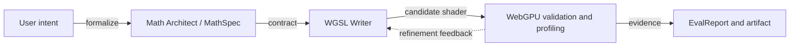
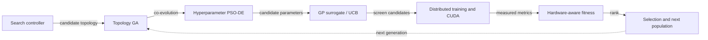
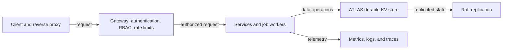
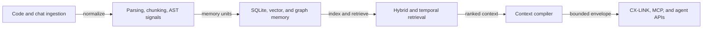
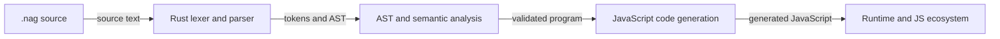
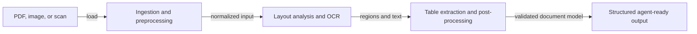

  

  

  

---

## About

I’m a B.Tech Data Science student building systems at the intersection of **AI/ML, systems engineering, and developer tooling**. My current work spans **hardware-aware neural architecture search**, **agentic WebGPU/WGSL shader generation and profiling** with Shader Alchemist, **developer-memory infrastructure** with Cortexta, and **backend systems** with Go and Rust. I’m especially interested in compiler and language design, GPU computing, algorithmic optimization, and turning research ideas into reliable, measurable software.

**Contact:** [mdayanalam12a@gmail.com](mailto:mdayanalam12a@gmail.com)

 

---

## Tech Stack & Tools

  

  

---

## GitHub Analytics

  <picture>
    <source media="(prefers-color-scheme: dark)" srcset="./assets/overview.dark.svg"/>
    
  </picture>
  <picture>
    <source media="(prefers-color-scheme: dark)" srcset="./assets/contributions.dark.svg"/>
    
  </picture>

  <picture>
    <source media="(prefers-color-scheme: dark)" srcset="./assets/activity-graph.dark.svg"/>
    
  </picture>

📊 More Detailed Stats

 

  <picture>
    <source media="(prefers-color-scheme: dark)" srcset="./assets/languages.dark.svg"/>
    
  </picture>

---

## Project Portfolio

### Selected Projects

- **[Shader Alchemist](https://github.com/ayanalamMOON/Shader-Alchemist)** — An agentic engineering workflow for WebGPU/WGSL shader synthesis, validation, GPU profiling, and iterative optimization.
- **[NeuroSwarm AutoML](https://github.com/ayanalamMOON/NeuroswarmAutoml)** — Hardware-aware neural architecture search that co-evolves model topology and hyperparameters under latency and FLOP constraints.
- **[Helios](https://github.com/ayanalamMOON/Helios)** — A Go backend framework focused on durable storage, authentication, authorization, rate limiting, background jobs, and reverse-proxy capabilities.
- **[Cortexta](https://github.com/ayanalamMOON/Cortexta)** — A local-first developer-memory runtime with semantic retrieval and context management for coding workflows.
- **[Nagari](https://github.com/ayanalamMOON/Nagari)** — A Rust-based language project exploring a Python-like authoring experience and JavaScript ecosystem interoperability.

### Architecture Gallery

These high-level diagrams are generated from the portfolio manifest and refreshed automatically.

<!-- ARCHITECTURE-GALLERY-START -->
These high-level flows are rendered from the profile portfolio manifest. Update that manifest when a project's architecture materially changes.

<strong>Shader Alchemist</strong> · <a href="https://github.com/ayanalamMOON/Shader-Alchemist">repository</a>

Agentic WebGPU/WGSL shader synthesis, validation, GPU profiling, and iterative refinement.

<strong>NeuroSwarm AutoML</strong> · <a href="https://github.com/ayanalamMOON/NeuroswarmAutoml">repository</a>

Hardware-aware bi-level co-evolution of network topology and continuous hyperparameters.

<strong>Helios</strong> · <a href="https://github.com/ayanalamMOON/Helios">repository</a>

Go backend framework with ATLAS storage, Raft replication, gateway controls, jobs, proxying, and observability.

<strong>Cortexta</strong> · <a href="https://github.com/ayanalamMOON/Cortexta">repository</a>

Local-first developer memory with ingestion, hybrid retrieval, temporal context, and agent-facing interfaces.

<strong>Nagari</strong> · <a href="https://github.com/ayanalamMOON/Nagari">repository</a>

Rust-based language and toolchain exploring Python-inspired syntax with JavaScript ecosystem interoperability.

<strong>Aletheia</strong> · <a href="https://github.com/ayanalamMOON/aletheia">repository</a>

Document perception pipeline that turns PDFs, scans, and images into structured agent-consumable information.

<!-- ARCHITECTURE-GALLERY-END -->

### Engineering Notebook

An automatically refreshed index of recent default-branch engineering activity. Entries link to source commits; the feed does not invent experiment results or performance claims. Use the [experiment write-up template](./engineering-notebook/EXPERIMENT_TEMPLATE.md) for reproducible investigations.

<!-- ENGINEERING-NOTEBOOK-START -->
Automatically indexed from the configured repositories' default branches, covering the last 60 days.

- **2026-10-09 · Change · [Shader Alchemist](https://github.com/ayanalamMOON/Shader-Alchemist)** — [Merge branch 'main' of https://github.com/ayanalamMOON/Shader-Alchemist](https://github.com/ayanalamMOON/Shader-Alchemist/commit/4be7bc6a674d653bef6390e958814b8fde299beb)
- **2026-10-09 · Docs · [Shader Alchemist](https://github.com/ayanalamMOON/Shader-Alchemist)** — [updated readme](https://github.com/ayanalamMOON/Shader-Alchemist/commit/9ccf4e05a78604e1482b33255a5908fcee4b1678)
- **2026-10-09 · Docs · [Shader Alchemist](https://github.com/ayanalamMOON/Shader-Alchemist)** — [Add Shader Alchemist README artwork](https://github.com/ayanalamMOON/Shader-Alchemist/commit/2836365b2b76d1473d1cc0412014b3995169906b)
- **2026-10-09 · Feature · [Shader Alchemist](https://github.com/ayanalamMOON/Shader-Alchemist)** — [feat: harden WebGPU execution and expand ADK runtime integration](https://github.com/ayanalamMOON/Shader-Alchemist/commit/2f4bf325443231eb8a5678455adee43d47fbf6a2)
- **2026-10-09 · Feature · [Shader Alchemist](https://github.com/ayanalamMOON/Shader-Alchemist)** — [feat: harden WebGPU execution and expand ADK runtime integration](https://github.com/ayanalamMOON/Shader-Alchemist/commit/4b036c76d1bf79f082ae68850d4c5ee8e602c2e8)
- **2026-10-09 · Feature · [Shader Alchemist](https://github.com/ayanalamMOON/Shader-Alchemist)** — [feat: initial project scaffold with agent-core pipeline and WebGPU harness](https://github.com/ayanalamMOON/Shader-Alchemist/commit/f0f6e8acdc4908cf92a4e08bd5fc870a7fe31e83)
- **2026-09-21 · Change · [NeuroSwarm AutoML](https://github.com/ayanalamMOON/NeuroswarmAutoml)** — [style(context): apply Black formatting](https://github.com/ayanalamMOON/NeuroswarmAutoml/commit/8fdf1c97d3c1e2018f4b51509ff3ce8479a7abc9)
- **2026-09-21 · Feature · [NeuroSwarm AutoML](https://github.com/ayanalamMOON/NeuroswarmAutoml)** — [feat(context): add pretrained Cortexta context bridge](https://github.com/ayanalamMOON/NeuroswarmAutoml/commit/615df7b99840559ef1bfa61176887d313080b021)
- **2026-09-21 · Change · [Helios](https://github.com/ayanalamMOON/Helios)** — [Add realistic Helios retail demo application](https://github.com/ayanalamMOON/Helios/commit/6c065519e43f3c25f4d1310bc3523a085b849e4a)
- **2026-09-21 · Change · [Helios](https://github.com/ayanalamMOON/Helios)** — [Upgrade and integrate Helios command services](https://github.com/ayanalamMOON/Helios/commit/92948416c6feb69619a2af233bdcfa7d7d562158)

Labels are inferred from commit subjects and are navigation hints only. This feed does not claim that a benchmark, experiment, or correctness result passed.
<!-- ENGINEERING-NOTEBOOK-END -->

### Verified Project Health

Latest default-branch checks, release metadata, and declared licenses for the selected public repositories. Projects without configured checks are labelled accordingly rather than being marked as passing.

<!-- PROJECT-HEALTH-START -->
| Project | Latest commit checks | License | Latest release | Last push (UTC) |
|---|---|---|---|---|
| [Shader Alchemist](https://github.com/ayanalamMOON/Shader-Alchemist) | [Not configured](https://github.com/ayanalamMOON/Shader-Alchemist/commit/4be7bc6a674d653bef6390e958814b8fde299beb/checks) | NOASSERTION | None published | 2026-10-09 |
| [NeuroSwarm AutoML](https://github.com/ayanalamMOON/NeuroswarmAutoml) | [Passing](https://github.com/ayanalamMOON/NeuroswarmAutoml/commit/8fdf1c97d3c1e2018f4b51509ff3ce8479a7abc9/checks) | MIT | [v0.2.0](https://github.com/ayanalamMOON/NeuroswarmAutoml/releases/tag/v0.2.0) | 2026-09-21 |
| [Helios](https://github.com/ayanalamMOON/Helios) | [Not configured](https://github.com/ayanalamMOON/Helios/commit/6c065519e43f3c25f4d1310bc3523a085b849e4a/checks) | MIT | [v0.1.0](https://github.com/ayanalamMOON/Helios/releases/tag/v0.1.0) | 2026-09-21 |
| [Cortexta](https://github.com/ayanalamMOON/Cortexta) | [Passing](https://github.com/ayanalamMOON/Cortexta/commit/433b5eb0836fae818dbfc8afeb933df106d61761/checks) | MIT | [v0.1.3](https://github.com/ayanalamMOON/Cortexta/releases/tag/v0.1.3) | 2026-08-11 |
| [Nagari](https://github.com/ayanalamMOON/Nagari) | [Passing](https://github.com/ayanalamMOON/Nagari/commit/7747c5ffed71830c9e8d9135c85fa023e349d320/checks) | MIT | None published | 2025-11-01 |
| [Aletheia](https://github.com/ayanalamMOON/aletheia) | [Not configured](https://github.com/ayanalamMOON/aletheia/commit/5e4fb50bc5b3e088cdb43e88c480dbbb86db9604/checks) | MIT | None published | 2026-01-28 |

Checks apply to the latest commit on each default branch. “Not configured” means GitHub reported no checks or commit statuses; it is not a passing result. Release and license values come from repository metadata.
<!-- PROJECT-HEALTH-END -->

### Recently Updated Repositories

<!-- PROJECTS-START -->
**Recently Updated Projects:**

- **[Shader-Alchemist](https://github.com/ayanalamMOON/Shader-Alchemist)** — Agentic WebGPU/WGSL shader synthesis, validation, GPU profiling, and iterative optimization.
  
  `Python` · *Updated Today* · `WebGPU` · `WGSL` · `GPU Computing`

- **[NeuroswarmAutoml](https://github.com/ayanalamMOON/NeuroswarmAutoml)** — Hardware-aware neural architecture search that co-evolves network topologies and hyperparameters under latency and FLOP constraints.
  
  `Python` · *Updated 2 weeks ago* · `AutoML` · `Neural Architecture Search`

- **[Helios](https://github.com/ayanalamMOON/Helios)** — Go backend framework with durable storage, authentication, RBAC, rate limiting, background jobs, and reverse-proxy capabilities.
  
  `Go` · *Updated 2 weeks ago* · `Go` · `Backend Systems`

- **[aletheia](https://github.com/ayanalamMOON/aletheia)** — Document perception for AI coding agents, including OCR, layout analysis, and table extraction.
  
  `Python` · *Updated 1 month ago* · `Document AI` · `Developer Tools`

- **[polyglot-app](https://github.com/ayanalamMOON/polyglot-app)** — Description not provided yet.
  
  `HTML` · *Updated 2 months ago*

- **[Cortexta](https://github.com/ayanalamMOON/Cortexta)** — Local-first developer-memory runtime with semantic retrieval and context management for coding workflows.
  
  `TypeScript` · *Updated 2 months ago* · `Developer Tools` · `Memory Runtime`

*Last updated: October 09, 2026 at 18:08 UTC*
<!-- PROJECTS-END -->

---

## Contribution Footprint

This repository-local chart ranks public repositories by recent commit activity and refreshes automatically.

  <!-- Generated by .github/workflows/refresh-profile.yml -->
  <picture>
    <source media="(prefers-color-scheme: dark)" srcset="./assets/repositories.dark.svg"/>
    
  </picture>

---

## Connect

  

  
  

  

---

  

  

